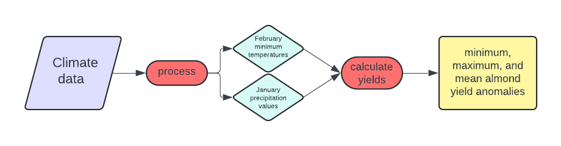

### Conceptual Diagram



### Testing the almond yield anomaly function

```{r, message = FALSE, warning = FALSE}
# source the function from the R script
source("../week2/assignment2.R")

# test the function on our clim.txt data
almond_yield_anomaly("../data/clim.txt")
```

