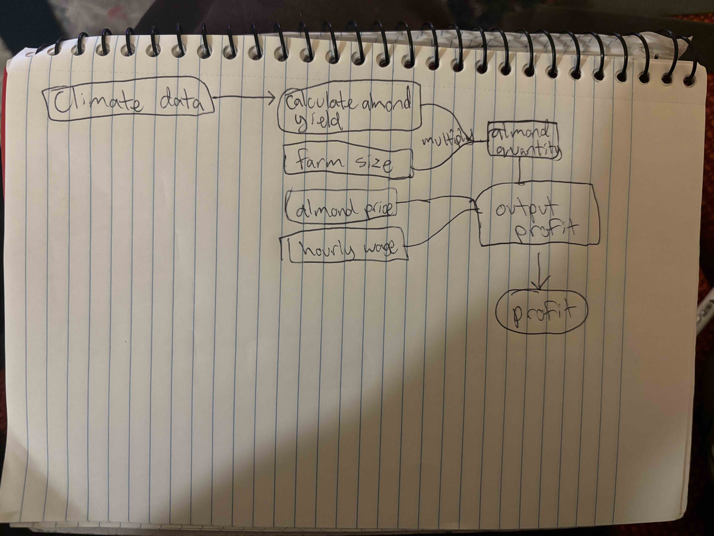

```{r setup, include=FALSE}
knitr::opts_chunk$set(echo = TRUE, warning = FALSE, message = FALSE)
```

```{r}
# load packages
library(tidyverse)
library(here)
```

```{r}
# source function from R script
source(here::here("week3/assignment3.R"))
```

```{r}
# range of hourly wages to test
hourly_wages <- seq(30, 45, by = 1) # impact of up to 50% increase in hourly wage

# vector for storing results
profits <- numeric(length(hourly_wages))

# loop through each hourly wage to calculate profits
for (i in seq_along(hourly_wages)) {
  profits[i] <- almond_profit(hourly_wage = hourly_wages[i])}

# create df for plotting
results_df <- tibble(hourly_wage = hourly_wages, profit = profits)

# plot results
ggplot(results_df, aes(x = hourly_wage, y = profit)) +
  geom_line(color = "darkseagreen") +
  theme_minimal() +
  labs(title = "Sensitivity of almond farm profit to hourly wage",
       x = "Hourly wage ($)",
       y = "Profit ($)")

```

```{r}
# range of prices to test
prices <- seq(100, 110, by = 5) # impact of up to 10% increase in almond price per ton

# vector for storing results
profits <- numeric(length(prices))

# loop through each price to calculate profits
for (i in seq_along(prices)) {
  profits[i] <- almond_profit(price = prices[i])
}

# create df for plotting
results_df <- tibble(price_per_ton = prices, profit = profits)

# plot results
ggplot(results_df, aes(x = price_per_ton, y = profit)) +
  geom_line(color = "cornflowerblue") +
  theme_minimal() +
  labs(title = "Sensitivity of almond farm profit to price per ton",
       x = "Price per ton of almonds ($)",
       y = "Profit ($)")

```

- Our almond profit model takes the parameters almond yield, farm acres, price, hourly wage, and climate data. We decided to vary price (for a ton of almonds) and hourly wage (wage paid to workers). Many businesses consider the tradeoff between increasing workers' wages, likely needing to increase prices. Since our sensitivity analysis is informal, we simply vary the parameters independent of one another, feeding a range of possible values into our model. This way, when one parameter is being varied, the other remains constant. Our first plot shows that as hourly wages increase holding price fixed, profits go down. Our second plot shows that as price increases holding wage fixed, profit goes up. We varied linearly for both parameters, so profit appears to show roughly equal sensitivity to both parameters based on the similar slopes of the lines.


## Workflow diagram for almond profit model




